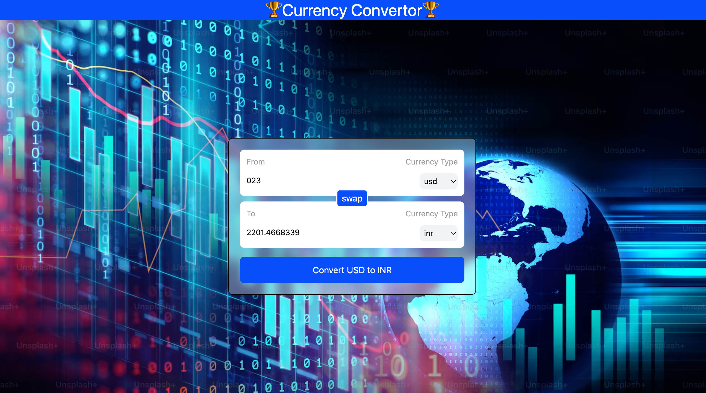

# 💱 React Currency Converter

A responsive and user-friendly currency converter built with **React.js** and **Vite**. The application uses real-time exchange-rate data from the Currency API and allows users to convert amounts between different currencies.

## 🚀 Live Demo

🔗 https://react-currency-convertor-ziua.vercel.app/

---

## 📸 Preview



---

## ✨ Features

- 💱 Convert between different currencies
- 🔄 Swap "From" and "To" currencies
- 📊 Fetches exchange rates from an external API
- ⚡ Real-time currency conversion
- 🎨 Responsive and modern user interface
- 📱 Works on desktop and mobile devices
- ⚛️ Built using React Hooks
- 🧩 Reusable `InputBox` component
- 🪝 Custom React Hook for fetching currency data
- 🚀 Deployed on Vercel

---

## 🛠️ Tech Stack

- **React.js**
- **Vite**
- **JavaScript (ES6+)**
- **HTML5**
- **CSS3**
- **Tailwind CSS**
- **React Hooks**
  - `useState`
  - `useEffect`
  - `useCallback`
- **Custom Hooks**
- **Currency API**
- **Vercel**

---

## 📂 Project Structure

```text
React-Currency-Converter/
│
└── CurrencyConvertor/
    │
    ├── public/
    │
    ├── src/
    │   ├── components/
    │   │   ├── InputBox.jsx
    │   │   └── index.js
    │   │
    │   ├── hooks/
    │   │   └── useCurrencyInfo.js
    │   │
    │   ├── App.jsx
    │   ├── App.css
    │   ├── index.css
    │   └── main.jsx
    │
    ├── package.json
    ├── vite.config.js
    └── index.html


⚙️ How It Works

The application follows a simple flow:

User enters amount
        ↓
Selects From Currency
        ↓
Selects To Currency
        ↓
Fetch exchange rate
        ↓
Calculate conversion
        ↓
Display converted amount


🪝 Custom Hook

A custom React Hook called useCurrencyInfo is used to fetch currency exchange-rate data.

const currencyInfo = useCurrencyInfo(from);

The hook fetches the exchange-rate data whenever the selected source currency changes.

Example API endpoint:

https://cdn.jsdelivr.net/npm/@fawazahmed0/currency-api@latest/v1/currencies/usd.json


🔄 Currency Swap

The application includes a swap button that exchanges the selected currencies.

For example:

USD → INR

becomes:

INR → USD

The entered amount and converted amount are also swapped accordingly.


📦 Installation
1. Clone the repository
git clone https://github.com/Annu9111/React-Currency-convertor.git
2. Navigate to the project
cd React-Currency-convertor/CurrencyConvertor
3. Install dependencies
npm install
4. Start the development server
npm run dev

The application will run locally at:

http://localhost:5173


🏗️ Build for Production

To create a production build:

npm run build

The optimized production files will be generated inside:

dist/


🚀 Deployment

This project is deployed using Vercel.

Every time changes are pushed to the connected GitHub repository, Vercel can automatically create a new deployment.

Build Configuration
Framework: Vite
Build Command: npm run build
Output Directory: dist


📚 React Concepts Practiced

This project helped me practice several important React concepts:

Components
Props
State management
Event handling
Controlled inputs
useState
useEffect
Custom Hooks
API fetching
Conditional rendering
Array methods
Object.keys()
Dynamic object properties
Parent-to-child communication
Callback functions
Component reusability
Vercel deployment


🎯 Learning Goals

The main goal of this project was to understand how React applications can communicate with external APIs and update the UI dynamically based on user input.

It also helped me understand how to create reusable components and custom hooks in React.

👩‍💻 Author

Annu Kumari Soni
